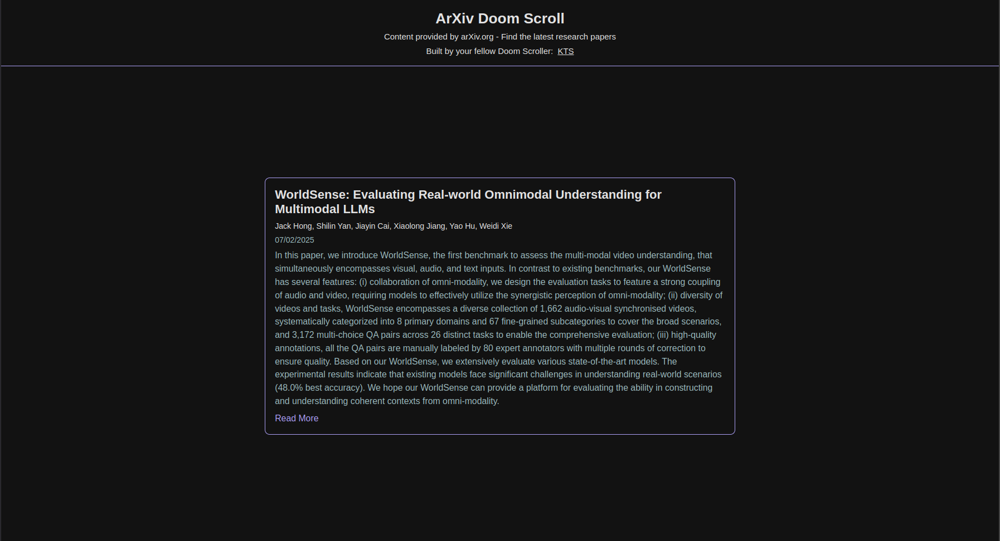

# ArXiv Doom Scroll

A modern, responsive web application that lets you doom scroll through the latest Computer Science AI research papers from arXiv.org. Built with React, TypeScript, and styled-components.



## Features

- 🔄 Infinite scrolling through AI research papers
- 📱 Responsive design that works on both desktop and mobile
- 🎯 Smooth animations and transitions
- 📖 Clean, readable paper presentations
- 🔗 Direct links to PDF versions of papers
- 🎨 Dark theme for comfortable reading
- 📱 Touch-friendly navigation for mobile devices

## Tech Stack

- React
- TypeScript
- styled-components
- arXiv API
- XML Parser

## Getting Started

### Prerequisites

- Node.js (v14 or higher)
- npm or yarn

### Installation

1. Clone the repository:

```bash
git clone https://github.com/KTS-o7/arxiv-doom-scroll.git
```

2. Install dependencies:

```bash
yarn install
```

3. Start the development server:

```bash
yarn start
```

4. Open [http://localhost:3000](http://localhost:3000) to view it in your browser.

## Usage

- 🖱️ **Desktop**: Use your mouse wheel to scroll up and down through papers
- 📱 **Mobile**: Swipe up and down to navigate between papers
- 🔗 Click "Read More" to open the full paper in a new tab
- 📄 Each card shows the paper's title, authors, publication date, and abstract

## API Integration

The application uses the arXiv API to fetch papers. It:

- Initially loads 50 papers
- Focuses on Computer Science AI papers (category: cs.AI)
- Sorts papers by submission date
- Respects arXiv's rate limiting with built-in delays

## Project Structure

```
src/
├── components/
│   ├── Card/
│   ├── CardGrid/
│   └── Navbar/
├── data/
│   └── types.ts
├── utils/
│   └── arxivApi.ts
└── App.tsx
```

## Styling

The project uses styled-components with:

- Responsive breakpoints for different screen sizes
- Consistent spacing system
- Dark theme optimization
- Smooth animations
- Custom scrollbar styling

## Contributing

1. Fork the repository
2. Create your feature branch (`git checkout -b feature/AmazingFeature`)
3. Commit your changes (`git commit -m 'Add some AmazingFeature'`)
4. Push to the branch (`git push origin feature/AmazingFeature`)
5. Open a Pull Request

## License

This project is licensed under the GNU GENERAL PUBLIC License - see the [LICENSE](LICENSE) file for details.

## Acknowledgments

- Content provided by [arXiv.org](https://arxiv.org)
- Built by [KTS](https://github.com/KTS-o7)
- Inspired by the endless scrolling through research papers

## Contact

- GitHub: [@KTS-o7](https://github.com/KTS-o7)

## Future Improvements

- [ ] Add search functionality
- [ ] Implement paper categories filtering
- [ ] Add Gen-AI summary of the paper
